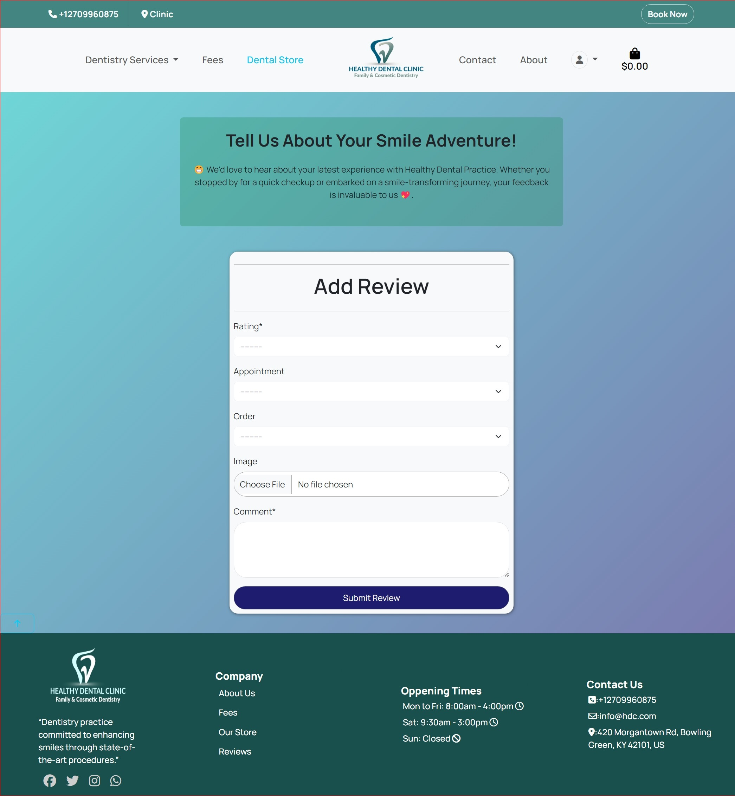

# Healthy Dental Clinic

<a name="top" id="top"></a>


## Table of Contents

- [Introduction](#introduction)
- [Showcase](#showcase)
  - [Strategy](#strategy)
- [UX (User Experience)](#ux-user-experience)
  - [User Stories](#user-stories)
    - [As a Patient (Site User)](#as-a-patient-site-user)
    - [As Admin User](#as-admin-user)
- [Additional Features](#additional-features)
- [Architecture](#architecture)
- [Design](#design)
- [Navigation](#navigation)
- [Project Type](#project-type)
  - [Homepage](#homepage)
  - [Appointment Booking](#appointment-booking)
    - [User Authentication](#user-authentication)
    - [Registration](#registration)
    - [Login/Registration](#loginregistration)
    - [Logout](#logout)
  - [Booking Appointments](#booking-appointments)
    - [By User Authentication](#by-user-authentication)
    - [Booking Form](#booking-form)
    - [Success Page](#success-page)
  - [Dentistry Services](#dentistry-services)
    - [Service Detail](#service-detail)
    - [User Profile (for Logged-in Users)](#user-profile-for-logged-in-users)
    - [Fees Page](#fees-page)
    - [Admin Features (for Staff/Dentists)](#admin-features-for-staffdentists)
- [Footer](#footer)
- [Reviews](#reviews)
  - [Adding a Review](#adding-a-review)
  - [Editing a Review](#editing-a-review)
  - [Deleting a Review](#deleting-a-review)
  - [Viewing Reviews](#viewing-reviews)
- [404 Page](#404-page)
- [Contact and About Pages](#contact-and-about-pages)

* [Dental Store (All Products)](#dental-store-all-products)
* [Basket](#basket)
  * [Basket Icon](#basket-icon)
* [Checkout](#checkout)
  * [Checkout Success](#checkout-success)
  * [Order Confirmation Email](#order-confirmation-email)
* [Technologies](#technologies)
  * [Languages](#languages)
  * [Frameworks, Programs, and Libraries Used](#frameworks-programs-and-libraries-used)
* [Testing](#testing)
  * [Manual Testing](#manual-testing)
  * [User Story Testing (Admin)](#user-story-testing-admin)
  * [User Story Testing](#user-story-testing)
  * [Functionality Testing](#functionality-testing)
  * [Compatibility Testing](#compatibility-testing)
  * [HTML Validator](#html-validator)
  * [Lighthouse](#lighthouse)

- [JavaScript Enhancements](#javascript-enhancements)
- [Python](#python)
- [Deployment](#deployment)
  - [Render PostgresSQL Database](#render-postgresql-database)
    - [Setting up Render PostgreSQL for Heroku Django App](#setting-up-render-postgresql-for-heroku-django-app)
    - [Steps:](#steps)
      - [1. Create a PostgreSQL Database on Render:](#1-create-a-postgresql-database-on-render)
      - [2. Obtain Connection Details:](#2-obtain-connection-details)
      - [3. Set Environment Variables on Heroku:](#3-set-environment-variables-on-heroku)
    - [Explanation:](#explanation)
  - [Amazon AWS](#amazon-aws)
    - [S3 Bucket](#s3-bucket)
    - [IAM](#iam)
    - [Set up AWS](#set-up-aws)
  - [Stripe API](#stripe-api)
  - [Gmail API](#gmail-api)
- [Heroku](#heroku)
  - [Render PostgreSQL Database](#render-postgresql-database)
  - [Amazon AWS](#amazon-aws)
  - [Stripe API](#stripe-api)
  - [Gmail API](#gmail-api)
- [Cloning Project](#cloning-project)
- [Forking Project](#forking-project)
- [Credits](#credits)
- [Acknowledgement and Support](#acknowledgement-and-support)

## Introduction

Healthy Dental Clinic is a web application designed for a dental practice. It allows patients to book appointments, learn about services, and access a dental store and reviews. The project is built using:

* **Backend:** Python and Django
* **Frontend:** HTML, CSS, and JavaScript

While fully functional, this site primarily serves as an educational project to demonstrate web development skills.

Link to the deployed site can be found [Here](https://healtydentalclinic-8f35f633fd68.herokuapp.com/)

## Showcase


### Strategy

 Healthy Dental Clinic aims to offer an easy-to-navigate online platform for patients to access dental services. Given the increasing demand for online healthcare services, this platform provides flexible and convenient options for booking appointments, accessing dental care information, and managing patient profiles.

* **Target Audience:** Individuals and families seeking dental care services.
* **Goals:** Provide a user-friendly platform for patients to:
  * Easily schedule appointments online.
  * Explore information about the clinic and its services.
  * Purchase dental hygiene products from the online store.

## UX (User Experience)

### User Stories

### As a Site User

* As a site user, I can create or edit my account so that I can update my details accordingly.
* As a site user, I can log in to my account so that I can view my appointment history.
* As a site user, I can search for dental services so that I can find specific treatments.
* As a site user, I can sort dental services based on criteria such as price and category so that I can find the services I need.
* As a site user, I can browse through dental services so that I can decide what I may be interested in.
* As a site user, I can look at service details so that I can decide if I want to book an appointment.
* As a site user, I can easily book appointments online so that I can plan my visits conveniently.
* As a site user, I can view the contents of my booking basket so that I can make any adjustments before confirming.
* As a site user, I can update my booking by adding more or removing services so that I can decide on the number of services I intend to avail.
* As a site user, I can view my order summary so that I can verify it before confirming.
* As a site user, I can check out securely so that I can maintain the level of trust in the site.
* As a site user, I can view reviews posts so that I can  read.
* As a site user, I can comment on the reviews page so that I can express my opinion about appointment or shopping.
* As a site user, I can use the contact form so that I can contact the clinic.
* As a site user, I can sign up for the newsletter so that I can keep updated on the latest news and dental tips.

#### As a Patient (Site User)

* **Book Appointments:**
  * Easily book appointments online, selecting date, time, and service.
  * View available time slots.
  * Provide contact information and notes.
* **Learn About Services:**
  * Browse information about dental services.
  * See service details (descriptions, fees).
  * View dentist profiles and specializations.
  * View Reviews and post new one
* **Dental Store:**
  * Access the online store to purchase dental hygiene products.
  * Browse, add to cart, and securely checkout.
  * View order history and track orders.

#### As Admin User

* **Manage Appointments:**

  * View and manage upcoming appointments.
  * Update appointment statuses (confirm, complete, cancel).
  * Access patient information and notes.
* **Manage Products (Optional):**

  * Add, update, and Cancel products in the online store.
  * Informe user by email about any update

  ![homepage wireframe]


## Additional Features

* **User Accounts:** View appointments and order history.
* **Email Notifications:**  Confirmations for appointments and orders.

### Strategy

* **Online Presence:** Establish a strong online presence for the practice.
* **Convenience:** Provide easy access to services and information.
* **Engagement:** Engage patients with educational content and a user-friendly interface.

## Architecture

## Design

Before I wrote any code for this site, I had to pin point a simple design of what I wanted my site to look like by using wireframes, not only for myself but as well of communicating what I wanted to achieve to my mentor.

<details>

![homepage wireframe]


 ![store wireframe]


  ![profile page wireframe]


  ![product-detail_wireframe]


  ![book_appointment]


</details>

## Navigation

I created a flowchart to visualize the website structure.

    `<pre>` Homepage
                |
                v
            [About Us] --> [Team] --> [Individual Dentist Profiles]
                |
                v
            [Services] --> [General Dentistry] --> [Specific Procedures]
                      |
                      v
                      [Cosmetic Dentistry] --> [Specific Procedures]
                      |
                      v
                      [Restorative Dentistry] --> [Specific Procedures]
                |
                v
            [Patient Resources] --> [Forms] --> [New Patient Forms]
                              |
                              v
                              [book appointement]
                |
                v
            [Contact Us] --> [form contact]
                |
                |
            [Appointment Scheduling] --> [Calendar] --> [Confirmation]
            `</pre>`


## Project Type

Healthy Dental Clinic is a web application designed to support the online presence of a dental practice. The functionality on this site for a patient is the ability to book appointments, learn about services, and purchase dental products conveniently. For the clinic staff, the goal is to manage appointments, patient information, and potentially the online store inventory.

### Homepage

The homepage welcomes patients with a logo, navigation menu, and a hero section highlighting the clinic's mission and services. It features:

* **Header and Navigation:**
  ![header]

  
* **Hero Section:**

  ![hompage_hero]

  
* **Call to Action:** Clear buttons or links to encourage appointment booking or exploring services.

### Appointment Booking

The appointment booking page allows patients to easily schedule appointments:

![appointment_booking]


* **User Authentication:**
* **Registration:**
  ![signup]

  

  - New users can sign up for an account.
  - Existing users can log in.
  - Authentication is handled securely using Django Allauth.
* **Login/Registration:**
  ![login]


- New users can register for an account to manage appointments and view their order history.
- Existing users can log in securely using their email and password.
- The authentication process is handled by Django Allauth, providing a robust and secure framework.

* **Logout:**
  ![logout]


  - Authenticated users can easily log out to protect their account information.

### Booking Appointments

* **By User Authentication :**

  -by creating an account allows users to manage their appointments more effectively and access additional features.
* **Booking Form:**

  - User-friendly form to select the service,  (if applicable), date, and time.
  - Form validation ensures correct data entry.
* **Success Page:**

  - Confirms the booked appointment.

    ![logout]

    

## Dentistry Services

The navigation bar provides easy access to all the dental services offered by the clinic.

### Service Detail

Each service page provides detailed information, including:

* **Description:**  A clear explanation of the service and its benefits.
* **Fees:**  Transparent pricing information for the service.
* **Appointment Booking:** A convenient link or button to book an appointment for that specific service.

<details>
  <summary>Click here to view different services pages:</summary>

  ![resto]


  ![general]


   ![cosmetic]


</details>

### User Profile (for Logged-in Users)

* **Personal Information:** View and update contact details, shipping addresses, and other relevant information.
* **Appointment History:** View a list of upcoming and past appointments, with the option to reschedule or cancel.
* **Order History (if applicable):**  For users who have purchased items from the dental store, view their order history and track shipments.

![profile]


### Fees Page

A comprehensive page listing all fees for the services offered by the clinic:

* **Categorized Fees:** Fees are organized by service category (general, cosmetic, restorative) for easy navigation.
* **Clear Pricing:** Transparent display of all associated costs.

![profile]


### Admin Features (for Staff/Dentists)

* **Manage Appointments:**
  - View, update, and cancel appointments.
  - Access patient information and notes.

[Image of the admin appointment management interface]

* **Manage Products :**
  - Add, edit, and delete products in the dental store .

![products manager]


![edit product]


## Footer

The footer appears on all pages of the site and provides essential information and contact details:

* **Clinic Information:**

  * A brief description of the dental practice's commitment to quality care and modern dentistry.
  * Clinic logo to reinforce branding.
  * Social media links for Facebook, Twitter, Instagram, and WhatsApp.
* **Company Links:**

  * Quick links to key pages on the website, such as About Us, Fees, Our Store (if applicable), and Reviews.
* **Opening Times:**

  * Clearly displays the clinic's opening hours for each day of the week, including closed days.
* **Contact Information:**

  * Phone number for direct contact with the clinic.
  * Email address for inquiries.
  * Full physical address of the clinic.

![footer]


## Reviews

The Reviews app allows users to share their experiences and feedback about the dental services they have received. This feature enhances user engagement and helps potential patients make informed decisions based on the experiences of others.

### Adding a Review

Users can easily add a review by filling out a form that includes their feedback and an optional image to accompany their review. This allows users to visually share their experience.

![Add Review]



### Editing a Review

If users wish to update their feedback or change the accompanying image, they can edit their existing reviews. This ensures that the information remains relevant and accurate.

![Edit Review]


### Deleting a Review

Users have the option to delete their reviews if they no longer wish to share their feedback. This gives users control over their shared content.

![Delete Review]


### Viewing Reviews

All submitted reviews are displayed in a dedicated section, allowing users to read about others' experiences with the dental services. Reviews can be sorted by date or rating to help users find the most relevant feedback.

![View Reviews]


This feature helps create a transparent and interactive community around the dental practice, fostering trust and encouraging new patients to book appointments based on positive reviews from existing patients.

# 404 page

A 404 page  and 403 is also available to handle navigation errors with a home link button to take them back to the home page
![error handling]


### Contact and About Pages

### Purpose

- **Contact Page:** Allows users to easily send messages or inquiries to the dental practice.
- **About Page:** Provides information about the dental practice and introduces the staff (dentists).

### Functionality

- **Contact Form:**
  - Presents a user-friendly form for entering their name, email, subject, and message.
  - Validates the form input to ensure data integrity.
  - Sends the message to the practice and stores it in the database.
  - Displays success or error messages based on the outcome of form submission.
- **About Us Display:**
  - Retrieves the list of dentists from the database.
  - Renders the `about.html` template, showcasing information about the practice and the dentists.

### Code Structure (contact app)

- **`views.py`:**
  - `contact(request)`: Function-based view that handles the contact form rendering, submission, and validation.
  - `AboutTemplateView`: Class-based view that renders the "About Us" page with dentist data.
- **`templates/contact/`:**
  - `contact.html`: Template for the contact form.
  - `about.html`: Template for displaying information about the practice and dentists.
- **`forms.py`:**
  - `ContactForm`: Defines the structure and validation rules for the contact form.
- **`models.py`:**
  - `Contact`: Model representing a contact message (name, email, subject, message).
- **`urls.py`:**
  - Defines URL patterns for the contact and about views.

### Example Usage

1. **Contact:**
   - Users visit the contact page and fill out the form.
   - Upon submission, they receive a success message if the message is sent successfully, or an error message if there's an issue.
2. **About Us:**
   - Users visit the About Us page to learn about the practice and the dentists on staff.

I hope this explanation is helpful! Let me know if you have any other questions or would like to add more details to your README.md.

![contact page]


![about page]


### Dental store(All products)

Handled by products app ,all functions to view products ,manage products (CRUD ) related matter done in this app .

### Purpose

The Dental Store page provides a comprehensive view of all available dental products. Users can browse through the products, search for specific items, and add them to their shopping cart for purchase.

### Functionality

- **Product Listing:** Displays all dental products in an organized manner, potentially with categories, filtering, or sorting options.

![all products]


- **Search:** Allows users to search for products by name, description, or other relevant attributes.
- **Product Details:** Each product has its own page with detailed information, including images, descriptions, and pricing.
- **Add to Cart:** Users can easily add desired products to their shopping cart from the product listing or detail pages.

![product details]


- **Admin Product Management (CRUD):**
  - As an admin, you can add new products to the store using the `add_product` template.
  - You can edit existing product details using the `edit_product` template.
  - You can delete products from the store using the `product_confirm_delete` template to ensure safe removal.


**** Code Structure (products app)

- **`views.py`:**
  - Contains view functions/classes to render the product listing, search results, product detail pages, and handle add-to-cart actions.
  - Includes views for admin product management (create, read, update, delete).
- **`templates/products/`:**
  - `product_list.html`: Template for displaying the list of all products.
  - `product_detail.html`: Template for the individual product details.
  - `search_results.html`: Template for displaying search results.
  - (For Admin) `add_product.html`, `edit_product.html`, `product_confirm_delete.html`: Templates for managing products as an admin.
- **`models.py`:**
  - Defines the `Product` model to represent product data (name, description, price, images, etc.).
- **`urls.py`:**
  - Defines URL patterns for product views and admin actions.

### Example Usage

1. **User:**

   - **Browsing:** Navigate to the Dental Store page to see all products.
   - **Searching:** Use the search bar to find specific items.
   - **Viewing Details:** Click on a product to view more information.
   - **Adding to Cart:** Click the "Add to Cart" button on any product to add it to the basket.
2. **Admin:**

   - **Adding Products:** Use the admin interface to access the `add_product` form and fill in the details of new products.
   - **Editing Products:** Click the "Edit" button next to a product on the admin product list to access the `edit_product` form.
   - **Deleting Products:** Click the "Delete" button next to a product and confirm deletion on the `product_confirm_delete` page.

### Basket

The basket functionality allows users to add products to a temporary shopping cart before finalizing their purchase. It provides features to view the contents of the basket, update product quantities, and remove items.

### Code Structure

The basket functionality is primarily implemented in the `basket` app, which contains the following files:

- **`views.py`:**  This file defines the views responsible for rendering the basket page, adding/updating items, and handling checkout-related data.
- **`templates/basket/basket.html`:** This template is used to render the basket page, displaying the items added by the user.
- **`urls.py`:** (Optional) This file defines URL patterns for the basket views.
- **`models.py`:** (Optional) You might have a model to represent basket items (if you're not storing the basket data in the session).

  """
  Renders the shopping basket contents.

  This view retrieves the basket data from the session, fetches the corresponding product
  details, and prepares the context to be displayed in the basket template.
  """

  # ... (code to retrieve bag items and prepare context) ...

  return render(request, 'basket/basket.html', context)

![basket]


#### Basket icon

basket icon shown i all pages with items counts amount.


### Checkout

On the left side of the checkout, users provide their information, and on the right side is a summary of their order including the total and the delivery details.

![checkout]


Users have an option to save their information to a profile. Users will need to input their payment details. They still have an option to adjust the basket at this point by clicking the adjust basket button, or they can complete the order.

### Checkout Success

After completing an order, users receive an order confirmation with their details including an order number.
![order confirm]


### Order Confirmation Email


## Technologies

### Languages

* [HTML](https://developer.mozilla.org/en-US/docs/Web/HTML)
* [CSS](https://developer.mozilla.org/en-US/docs/Web/CSS)
* [Javascript](https://www.javascript.com/)
* [Python](https://www.python.org/)

### Frameworks, programs and libraries used

* [Django](https://www.djangoproject.com/) - Django is a high-level Python web framework that encourages rapid development and clean, pragmatic design.
* [Bootstrap4](https://getbootstrap.com/) - A css framework
* [Gitpod](https://www.gitpod.io/) - Gitpod was used as an IDE
* [Github](https://github.com/) - I used Github to store all the data of my project after pushing it
* [Heroku](https://www.heroku.com/) - is a cloud platform service  I used to deploy and host the project
* [Render PostgreSQL](https://dashboard.render.com/) - used as a database for the project
* [Font Awesome](https://fontawesome.com/) - Was used to add icons for my social media links.
* [PEP8ci](https://pep8ci.herokuapp.com/) - I used it to validate python code
* [Figma](https://figma.com/) - was used to draw wireframes
* [dbdiagram](https://dbdiagram.io/home) - was used to draw the database schema
* [Stripe](https://stripe.com/en-ie) - was used for checkout functionality and facilitate online payments
* [AWS](https://aws.amazon.com/s3/) - for  object storage through a web service interface.
* [Unsplash](https://unsplash.com/) - images used for the project
* [Pexels](https://www.pexels.com/) - images used for the project

# Testing

## Manual Testing

| Feature                     | Test                                                  | Expected Result                                                         | Actual Result |
| --------------------------- | ----------------------------------------------------- | ----------------------------------------------------------------------- | :-----------: |
| Logo                        | Clicking logo on homepage                             | Redirects user back to homepage                                         |     Pass     |
| Search                      | Using the search box                                  | Entering a search term returns relevant results                         |     Pass     |
| Search (No Results)         | Entering a search term with no matching products      | Displays a "No results found" message and potentially related products  |     Pass     |
| Navigation Links            | Clicking navigation links                             | Directs user to corresponding pages                                     |     Pass     |
| Dental store (All Products) | Clicking "All Products" link                          | Directs user to page displaying all products                            |     Pass     |
| Back to Top                 | Clicking back-to-top arrow on product pages (if used) | Scrolls user back to the top of the page                                |     Pass     |
| Sort By                     | Using the "Sort By" filter                            | Successfully sorts products by price, name, or category (if applicable) |     Pass     |
| Shop Now Button             | Clicking "Shop Now" button (if used)                  | Directs user to the "All Products" page                                 |     Pass     |
| About Us                    | Clicking "About Us" link                              | Directs user to "About Us" page                                         |     Pass     |
| Privacy Policy              | Clicking "Privacy Policy" link                        | Directs user to privacy policy page                                     |     Pass     |
| Facebook Icon               | Clicking Facebook icon                                | Opens your Facebook page in a new tab/window                            |     Pass     |
| Contact                     | Clicking "Contact" link                               | Directs user to contact page                                            |     Pass     |
| Contact Form                | Submitting contact form                               | Successfully sends form data and displays confirmation to user          |     Pass     |
| My Account (Admin)          | Accessing "My Account" as admin                       | Displays admin-specific dropdown menu with extra options                |     Pass     |
| Contact                     | Selecting Contact                                     | Directs user to contact page                                            |     Pass     |
| Contact Form Submission     | Submitting contact form                               | Successfully sends submitted form and can be seen in admin              |     Pass     |
| My Account                  | Selecting my account as admin                         | Displays dropdown menu unique to admin apart from profile and logout    |     Pass     |

## User Story Testing (Admin)

* **As an admin, I can manage users' accounts so that I can make any required changes to them if needed.**

  > Admin can view, edit, and delete user accounts from the admin panel.
  >
* **As an admin, I can manage products so that I can add, update, or delete products when necessary.**

  > Admin can add, edit, and delete products on the site through the admin panel.
  >
* **As an admin, I can view created orders so that I can fulfill them or make amendments if needed.**

  > Admin can view and manage orders in the admin panel.
  >
* **As an admin, I can view messages sent via the contact form so that I can act upon them.**

  > Admin can view and respond to messages in the admin panel.
  >

## User Story Testing

### User

* **As a site user, I can create or edit my account so that I can manage my information and appointments.**

  > - Users can create accounts and update their details through the registration and profile pages.
  > - Users can view and manage upcoming and past appointments.
  >
* **As a site user, I can log into my account so that I can view my order history and appointments.**

  > - Logged-in users have access to their complete order and appointment history.
  >
* **As a site user, I can search for services and products so that I can find what I need.**

  > - A search bar is available for users to quickly locate specific services, products, or information.
  >
* **As a site user, I can browse services and fees so that I can understand what the clinic offers and the associated costs.**

  > - Clear and detailed information about services and their fees is presented on the website.
  >
* **As a site user, I can book appointments online so that I can schedule visits at my convenience.**

  > - An intuitive appointment booking system allows users to choose dates and times.
  >
* **As a site user, I can browse and purchase products from the dental store.**

  > - The online store provides a user-friendly interface for browsing and selecting products.
  >
* **As a site user, I can view product details so that I can make informed purchase decisions.**

  > - Each product page includes comprehensive descriptions and relevant information.
  >
* **As a site user, I can add products to a cart and manage its contents.**

  > - Users can easily add or remove items from their cart and adjust quantities.
  >
* **As a site user, I can securely checkout and complete my purchase.**

  > - A secure checkout process ensures user data protection and transaction safety.
  >
* **As a site user, I can leave reviews about my experience with the clinic or its products.**

  > - A review system allows users to share their feedback and experiences.
  >
* **As a site user, I can edit my reviews if I need to update or correct them.**

  > - Users have the option to edit their previously submitted reviews.
  >
* **As a site user, I can contact the dental practice through a contact form.**

  > - A contact form facilitates communication between users and the dental practice.
  >
* **As a site user, I can sign up for a newsletter to stay informed about the latest news and offers.**

  > - A newsletter signup option keeps users informed about relevant updates.
  >

## Functionality testing

Throughout developing this site, I have been using Chrome, and chrome dev tools to help with debugging issues. Testing responsiveness was done using chrome emulated devices.

## Compatibility testing

Chrome emulated devices, and hardware devices iphone 13 pro, pixel 7 , ipad mini and ipad air were used to test compatibility

## Html Validator

All pages tested and sorted by checking pages on
[html validator ](https://validator.w3.org/nu/#textarea) tried my best
to remove errors .finaly i did and got this nicely message.

![validate image]


### Lighthouse

- I conducted Lighthouse testing in Incognito mode to obtain optimal results.

![lighthouse]


## JavaScript Enhancements

The following JavaScript code is used to add interactivity and visual effects to various elements of the website, primarily the homepage:

```javascript

<script>

    // Back-to-Top Button
    $('.btt-link').click(function(e){
        window.scrollTo(0,0);  // Smooth scroll to the top of the page
    });
  
    // Toast Messages (using Bootstrap)
    $(document).ready(function() {
        
            $('.toast').toast('show'); // Display any Django messages as toasts
        
    });


    // Fade-in Effect for Images
    window.addEventListener('load', function() {
        const fadeInImages = document.querySelectorAll('.fade-in-image'); // Select images with this class

        function checkImageVisibility() {
            fadeInImages.forEach((image) => {
                // ... (checks if image is in viewport and adds/removes 'in-view' class accordingly) ...
            });
        }

        window.addEventListener('scroll', checkImageVisibility); 
        checkImageVisibility(); // Trigger initially on page load
    });


    // Show Active Dropdown Link (commented out)
    // This code was likely intended to mark dropdown links as active based on the current page, but it's commented out.

    // Fade-in Reviews on Scroll
    window.addEventListener('scroll', function() {
        const reviewsSection = document.querySelector('.reviews'); // Select reviews section
        const cards = reviewsSection.querySelectorAll('.review-card');

        // ... (calculates if reviews section is visible and adjusts opacity of review cards) ...
    });
  
    // Slide-in Company Logos (commented out)
    // This section was intended to add a slide-in animation to company logos when they become visible, but it's commented out.
</script>

```

**Explanation of Key Features:**

- **Back-to-Top Button:** When the `.btt-link` element is clicked, the page smoothly scrolls to the top.
- **Toast Messages:** Django messages (success, error, etc.) are displayed as Bootstrap toasts.
- **Image Fade-in:** Images with the `.fade-in-image` class gradually fade into view as they enter the viewport.
- **Active Dropdown Link (Commented Out):** This code would have highlighted the currently active dropdown link in the navigation menu, but it's currently disabled.
- **Reviews Fade-in:** Reviews within the `.reviews` section fade in as the user scrolls down to them.
- **Slide-in Company Logos (Commented Out):** This section was intended to add a slide-in animation to company logos as they come into view, but it's currently inactive.

**Additional Notes:**

- **jQuery Dependency:** This code relies on jQuery (`$`) for DOM manipulation and event handling.
- **Commented-Out Sections:** The two commented-out sections provide hints about additional features you might have been working on, but they are not currently implemented.

Please let me know if you have any other questions.

and other js has been tested and
I used JSlint to validate javascript found in some apps

* basket app - semi colon warning
* base.html - zero warnings
* newsletter - 8 warnings but the code is directly from mailchimp
* checkout - semi colon warnings
* products - semi colon warnings
* profiles - no warnings

- I used [JSHint](https://jshint.com/) to validate my JavaScript code.


## Python

[ CI Python linter ](https://pep8ci.herokuapp.com/) was used to test python code

# Deployment

I developed this site local vs code, using git for version control. Then deployed to Heroku using the following steps

* Log in to [Heroku](https://id.heroku.com/login) or create an account
* Click New and Create New App
* I selected Europe as region.
* Click Create App button

https://docs.render.com/deploy-django

### Render PostgresSQL Database

This project uses [Render docouments](https://docs.render.com/deploy-django) for the PostgreSQL Database.

To create your Postgres Database, simply sign up with your GitHub account and follow these steps:

#### Setting up Render PostgreSQL for Heroku Django App

This guide will walk you through creating a PostgreSQL database on Render and connecting it to your existing Heroku Django application.

    ## Steps:

    ### 1. Create a PostgreSQL Database on Render:

    1.  Go to your[Render Dashboard](https://dashboard.render.com/).
          2.  Click "New" and choose "PostgreSQL."
          3.  Give your database a suitable name (e.g., `my-django-app-db`).
          4.  Select a region closest to your users for optimal performance.
          5.  Choose an appropriate instance type based on your project's size and traffic (you can start with a smaller one and scale up later if needed).
          6.  Click "Create Database."

    ### 2. Obtain Connection Details:

    1.  Once your database is created, navigate to its page on Render.
          2.  You'll find the**Internal** and **External Database URLs** in the "Connect" section. You'll need the **External Database URL** for Heroku.

    ### 3. Set Environment Variables on Heroku:

    1.  Use the Heroku CLI or the Config Vars section in your Heroku dashboard to set the`DATABASE_URL` environment variable.
          2.  The value for `DATABASE_URL` will be the **External Database URL** you copied from Render.
          3.  If your Render database requires SSL (it likely does), add another environment variable:

    heroku config:set PGSSLMODE=require

    4.added this to my settings fill>>
          '''
            if config('DATABASE_URL', default=None):
            DATABASES = {
             'default': dj_database_url.parse(config('DATABASE_URL'), conn_max_age=600, ssl_require=True)
              }
          else:
          DATABASES = {
            'default': {
               'ENGINE': 'django.db.backends.sqlite3',
               'NAME': os.path.join(BASE_DIR, 'db.sqlite3'),
             }
          }

    '''

    **Explanation:**

    ***Render PostgreSQL:**  Render is a simple and easy-to-use platform for creating and managing PostgreSQL databases.
          *   **External Database URL:** This URL provides the connection details your Django app needs to access the database on Render.
          *   **Environment Variables:** Heroku uses environment variables to configure your application.
          *   **`PGSSLMODE`:** This environment variable enforces a secure SSL connection to your database.

### Amazon AWS

This project utilizes  [AWS](https://aws.amazon.com) for storing media and static files online, as Heroku does not retain this data type.

After creating an AWS account and logging in, navigate to the AWS Management Console page and follow these steps to connect your project.

#### S3 Bucket

- Find and select S3.
- Create a new bucket, providing a name typically matching your Heroku app name, and select the region closest to you.
- Disable "Block all public access" and acknowledge that the bucket will be public, as it's required for Heroku operation.
- Ensure ACLs are enabled and select "Bucket owner preferred" under Object Ownership.
- Navigate to the Properties tab, enable static website hosting, and input "index.html" and "error.html" in their respective fields. Save your changes.
- Move to the Permissions tab and paste the following CORS configuration:

```
[
 {
  "AllowedHeaders": [
   "Authorization"
  ],
  "AllowedMethods": [
   "GET"
  ],
  "AllowedOrigins": [
   "*"
  ],
  "ExposeHeaders": []
 }
]
```

- Copy your **ARN** string.
- From the **Bucket Policy** tab, select the **Policy Generator** link, and use the following steps:
- Policy Type: **S3 Bucket Policy**

  - Effect: **Allow**
  - Principal: `*`
  - Actions: **GetObject**
  - Amazon Resource Name (ARN): **paste-your-ARN-here**
  - Click **Add Statement**
  - Click **Generate Policy**
  - Copy the entire Policy, and paste it into the **Bucket Policy Editor**

```
{
 "Id": "Policy1234567890",
 "Version": "2012-10-17",
 "Statement": [
  {
   "Sid": "Stmt1234567890",
   "Action": [
    "s3:GetObject"
   ],
   "Effect": "Allow",
   "Resource": "arn:aws:s3:::your-bucket-name/*"
   "Principal": "*",
  }
 ]
}
```

Before you click "Save", add /* to the end of the Resource key in the Bucket Policy Editor (as shown above).

- Click Save.

#### IAM

- Navigate to IAM by searching for it on the AWS Services Menu. Once on the IAM page, proceed with the following steps:
- Under User Groups, click on Create New Group.
- Suggested Name: healthydental (the group name combined with the project name)
- Tags are optional but must be clicked to access the review policy page.
- Select the newly created group from User Groups and move to the Permissions tab.
- Click on the Add Permissions dropdown and select Attach Policies.
- Choose the desired policy and click Add Permissions at the bottom to finish.
- Under the JSON tab, select the Import Managed Policy link.

```
{
 "Version": "2012-10-17",
 "Statement": [
  {
   "Effect": "Allow",
   "Action": "s3:*",
   "Resource": [
    "arn:aws:s3:::your-bucket-name",
    "arn:aws:s3:::your-bucket-name/*"
   ]
  }
 ]
}
```

- Click on Review Policy.
  - Suggested Name: healtydenatl
  - Provide a description: "Access to S3 Bucket for healthydental static files."
  - Click Create Policy.
- Under User Groups, select your "healtydentalclinic".
- Click Attach Policy.
- Search for the policy you've just created ("healtydentalclinic"), select it, then Attach Policy.
- Under User Groups, click Add User.
- Suggested Name: healthydental (user combined with the project name)
  - For "Select AWS Access Type," choose Programmatic Access.
  - Select the group to add your new user to: healthydental.
  - Tags are optional, but click it to access the review user page.
  - Click Create User once done.
- You should see a button to Download .csv, so click it to save a copy on your system.
  ***IMPORTANT: Once you pass this page, you cannot come back to download it again, so do it immediately!***
- This contains the user's Access key ID and Secret access key.
  - AWS_ACCESS_KEY_ID = Access key ID
  - AWS_SECRET_ACCESS_KEY = Secret access key.

#### Set up AWS

- If DISABLE_COLLECTSTATIC is still present in Heroku Config Vars, it can now be removed to allow AWS to handle static files.
- In the S3 dashboard, create a new folder named: media.
- Choose existing media images for your project to prepare them for upload into the new folder.
- Under Manage Public Permissions, select Grant public read access to this object(s)
- No further settings are required, so click Upload.

### Stripe API

This project utilizes [Stripe](https://stripe.com) to handle the ecommerce payments.
To integrate your project with Stripe, follow these steps:

- Navigate to your Stripe dashboard and expand "Get your test API keys".
  Here you'll find two keys:

  - STRIPE_PUBLIC_KEY = Publishable Key (starts with pk)
  - STRIPE_SECRET_KEY = Secret Key (starts with sk)
    As a backup in case users close the purchase-order page during payment, Stripe Webhooks can be included.
- In your Stripe dashboard, go to Developers, then select Webhooks.
- Click Add Endpoint.
- Use the endpoint: https://healtydentalclinic-8f35f633fd68.herokuapp.com/checkout/wh/
- Select receive all events.
- Click Add Endpoint to complete the process.
- You'll receive a new key:
  -STRIPE_WH_SECRET = Signing Secret (Webhook) Key (starts with wh)

### Gmail API

This project utilizes [Gmail](https://mail.google.com) to handle sending emails to users for account verification and purchase order confirmations.
To integrate your project with Gmail, follow these steps:

- Click on the Account Settings (cog icon) in the top-right corner of Gmail.
  Go to the Accounts and Import tab.
- Under "Change account settings", select Other Google Account settings.
- On the new page, choose Security from the left sidebar.
- Turn on 2-Step Verification. (verify your password and account)
- After verification, turn on 2FA.
- Return to the Security page and find App passwords.
- Confirm your password and account again if prompted.
- Select Mail for the app type.
- Choose Other (Custom name) for the device type.
- Use any custom name, like "Django"
- You'll receive a 16-character password (API key).
- Save this securely, as it can't be accessed later!
  - EMAIL_HOST_PASS = user's 16-character API key
  - EMAIL_HOST_USER = user's personal Gmail email address

### Heroku

This project utilizes [Heroku](https://www.heroku.com), a platform as a service (PaaS) that empowers developers to build, run, and manage applications entirely in the cloud.
Follow these deployment steps after setting up your account:

- Navigate to your Heroku Dashboard and click New in the top-right corner, then select Create new app.
- Choose a unique app name, select a region (EU or USA), and click Create App.
- In the app's Settings, click Reveal Config Vars, and set the following environment variables:

| Key                             | Value                                                                  |
| ------------------------------- | ---------------------------------------------------------------------- |
| **AWS_ACCESS_KEY_ID**     | user's own value                                                       |
| **AWS_SECRET_ACCESS_KEY** | user's own value                                                       |
| **DATABASE_URL**          | user's own value                                                       |
| **DISABLE_COLLECTSTATIC** | 1 (_this is temporary, and can be removed for the final deployment_) |
| **EMAIL_HOST_PASS**       | user's own value                                                       |
| **EMAIL_HOST_USER**       | user's own value                                                       |
| **SECRET_KEY**            | user's own value                                                       |
| **STRIPE_PUBLIC_KEY**     | user's own value                                                       |
| **STRIPE_SECRET_KEY**     | user's own value                                                       |
| **STRIPE_WH_SECRET**      | user's own value                                                       |
| **USE_AWS**               | True                                                                   |

Heroku needs two additional files in order to deploy properly.

- requirements.txt
- Procfile

You can install this project's **requirements** (where applicable) using:

- pip3 install -r requirements.txt

If you have your own packages that have been installed, then the requirements file needs updated using:

- pip3 freeze --local > requirements.txt

The **Procfile** can be created with the following command:

- echo web: gunicorn app_name.wsgi > Procfile
- _replace **app_name** with the name of your primary Django app name; the folder where settings.py is located_

For Heroku deployment, follow these steps to connect your own GitHub repository to the newly created app:

Either:

- Select **Automatic Deployment** from the Heroku app.

Or:

- In the Terminal/CLI, connect to Heroku using this command: heroku login -i
- Set the remote for Heroku: heroku git:remote -a app_name (replace _app_name_ with your app name)
- After performing the standard Git `add`, `commit`, and `push` to GitHub, you can now type:
  - git push heroku main

Your project is now successfully connected and deployed on Heroku!

### Cloning Project

A local clone of this repository can be made on GitHub. Please follow the below steps:

- Navigate to GitHub and log in.
- The [Dental clinic Repository](https://github.com/maisam2004/dental_clinic) can be found at this location.
- Above the repository file section, locate the 'Code' button.
- Click on this button and choose your clone method from HTTPS, SSH, or GitHub CLI, copy the URL to your clipboard by clicking the 'Copy' button.
- Open your Git Bash Terminal.
- Change the current working directory to the location you want the cloned directory to be made.
- Type git clone and paste in the copied URL from the step above.
- Press 'Enter' for the local clone to be created.
- Use the **pip3 install -r requirements.txt** command to install the dependencies and libraries needed for dental practice.
- Set up your env.py file and gather the PostgreSQL URL from ElephantSQL, if applicable, and add your SECRET_KEY and STRIPE/AWS keys if using these services.
- Ensure that your env.py file is placed in your .gitignore file and follow the remaining steps in the Django Project Setup section before pushing your code to GitHub.

### Forking Project

You can create a copy of the original repository on GitHub by following these steps:

- Log in to GitHub.
- Visit the [dentalhealthyclinic Repository](https://github.com/maisam2004/dental_clinic/tree/main/dentalhealthyclinic).
- Click the 'Fork' button at the top right of the repository page to make a copy in your own GitHub account.

You will now have a forked version of the repository in your GitHub account.

[Back to the top](#top)

## Tecnologies Used

#### Languages

- HTML
- CSS
- JavaScript
- Python

#### Frameworks and Libraries

- Django
- Bootstrap
- jQuery
- Stripe

#### Development and Deploy

- Heroku
- Git
- GitHub
- VsCode

## Credits

- [**Google Fonts**](https://fonts.google.com/)  - utilized for selecting the perfect typography
- [**AWS**](https://aws.amazon.com/) - employed as a storage solution for static and media files
- [**FavIcon.io**](https://favicon.io/favicon-converter/)  - utilized for compressing favicons
- [**FreePik**](https://www.freepik.com/)  - serves as a database for images
- [**Google Fonts**](https://fonts.google.com/)  - employed for selecting the best typography
- [**W3Schools**](https://www.w3schools.com/) - provides useful information and cheat sheets
- [**Code Institute**](https://github.com/Code-Institute-Org>) Boutique Ado  walkthroughs
- [**XML-Sitemaps.com**](https://www.xml-sitemaps.com/)  - utilized for generating XML sitemaps
- [**Coolors**](https://coolors.co/)) for color palette

### Acknowledgement and support

* This whole chapter took me months to complete  due to circumstances beyond control. Despite all this I would love to extend my gratitude to Code institute and their amazing team.
* The tutor support for this project in particular
* My Mentor Jubril sharp,straight and honest feedback
